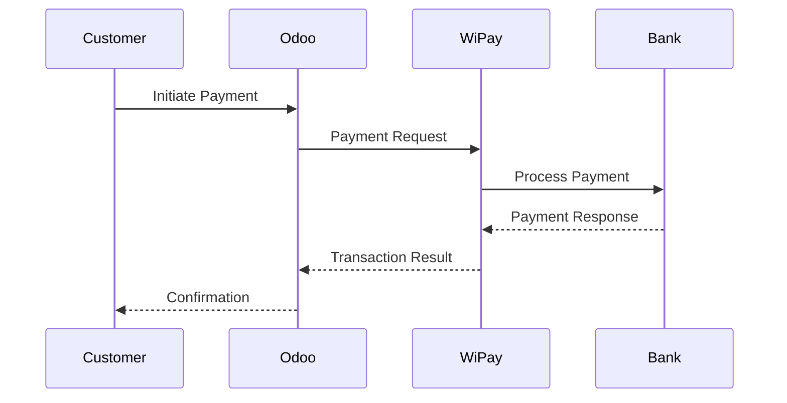

# Technical Documentation - WiPay Payment Provider

## Architecture Overview

### Core Components
1. **Provider Model** (`payment_provider.py`)
   - Handles provider configuration
   - Manages API credentials
   - Controls feature toggles
   - Fee calculation logic

2. **Transaction Model** (`payment_transaction.py`)
   - Payment processing
   - Response handling
   - Status management
   - Tokenization logic

3. **Security Layer** (`security_utils.py`)
   - Request signing
   - Data encryption
   - Validation
   - Rate limiting

4. **Controllers** (`main.py`)
   - HTTP endpoints
   - Webhook handling
   - Response processing
   - Error management

### Data Flow


## API Integration

### Authentication
```python
def _get_api_headers(self):
    """Generate authenticated API headers."""
    timestamp = str(int(time.time()))
    signature = self._generate_signature(timestamp)
    
    return {
        'X-WiPay-Account': self.wipay_account_number,
        'X-WiPay-Timestamp': timestamp,
        'X-WiPay-Signature': signature,
    }
```

### Request Signing
```python
def _generate_signature(self, timestamp):
    """Generate HMAC signature for API requests."""
    key = self.wipay_api_key.encode('utf-8')
    message = f"{self.wipay_account_number}:{timestamp}".encode('utf-8')
    return hmac.new(key, message, hashlib.sha256).hexdigest().
```

## Database Schema

### payment.provider
```sql
CREATE TABLE payment_provider (
    id serial PRIMARY KEY,
    wipay_account_number varchar(10),
    wipay_api_key varchar(64),
    wipay_country_code varchar(2),
    wipay_fee_structure varchar(20),
    wipay_enable_avs boolean,
    wipay_avs_decline_level varchar(10)
);
```

### payment.transaction
```sql
CREATE TABLE payment_transaction (
    id serial PRIMARY KEY,
    provider_id integer REFERENCES payment_provider(id),
    reference varchar(64),
    amount numeric(10,2),
    currency_id integer,
    state varchar(20),
    wipay_transaction_id varchar(64),
    date timestamp
);
```

## Security Implementation

### Data Encryption
```python
def _encrypt_sensitive_data(self, data):
    """Encrypt sensitive payment data."""
    key = self._get_encryption_key()
    f = Fernet(key)
    return f.encrypt(json.dumps(data).encode()).decode()
```

### Request Validation
```python
def _validate_webhook_request(self, data, signature):
    """Validate incoming webhook requests."""
    expected_signature = self._generate_signature(data)
    return hmac.compare_digest(signature, expected_signature)
```

## Error Handling

### Error Codes
- 1000: Authentication Error
- 2000: Validation Error
- 3000: Processing Error
- 4000: Network Error
- 5000: System Error

### Error Response Format
```json
{
    "error": {
        "code": "2000",
        "message": "Invalid card number",
        "details": "Card number failed Luhn check"
    }
}
```

## Testing

### Unit Tests
```python
@tagged('post_install', '-at_install')
class WiPayTest(WiPayCommon):
    def test_payment_processing(self):
        """Test basic payment processing."""
        tx = self._create_transaction(flow='direct')
        tx._send_payment_request()
        self.assertEqual(tx.state, 'done')
```

### Integration Tests
```python
def test_full_payment_flow(self):
    """Test complete payment flow including webhooks."""
    # Create transaction
    tx = self._create_transaction()
    
    # Process payment
    tx._process_payment()
    
    # Simulate webhook
    self._simulate_webhook(tx)
    
    # Verify final state
    self.assertEqual(tx.state, 'done')
```

## Performance Considerations

### Caching
```python
@tools.ormcache('self.id', 'amount', 'currency')
def _compute_fees(self, amount, currency):
    """Cached fee computation."""
    return self._calculate_transaction_fees(amount, currency)
```

### Database Optimization
- Indexed fields: reference, wipay_transaction_id
- Regular cleanup of old records
- Efficient query design

## Maintenance

### Version Updates
1. Update manifest version
2. Run database migrations
3. Update API endpoints if needed
4. Test all features
5. Update documentation

### Troubleshooting
1. Check Odoo logs
2. Verify API credentials
3. Confirm webhook configuration
4. Test network connectivity
5. Validate request signatures

## Best Practices

### Code Style
- Follow Odoo guidelines
- Use meaningful variable names
- Add docstrings
- Comment complex logic

### Security
- Validate all inputs
- Sanitize outputs
- Use secure communication
- Implement rate limiting
- Log security events

### Performance
- Optimize database queries
- Implement caching
- Use background jobs
- Monitor response times

## Support and Resources
- WiPay API Documentation
- Odoo Development Guide
- Security Guidelines
- Testing Framework